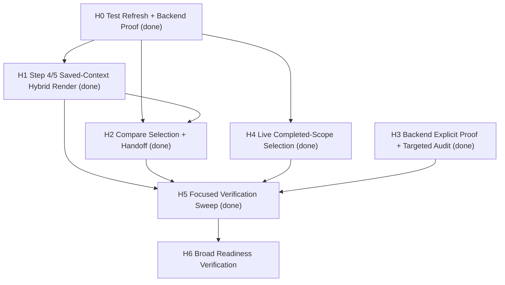

# Hardening Task Graph

Updated at: 2026-03-31T08:32:41-07:00

## Task List

### H0. Refresh stale assertions and lock explicit backend proof

- Task id: `task-20260331-hardening-000`
- Status: completed
- Owner: Carver-equivalent + Dirac-equivalent
- Files:
  - `tests/smoke/probabilistic-runtime.spec.mjs`
  - `backend/tests/integration/test_probabilistic_operator_flow.py`
- Verification:
  - backend report-context integration proof remains green
  - Step 5 history replay contract stayed green after the later prompt-3 smoke rerun

### H1. Restore Step 4/5 hybrid workspace derivation from hydrated report context

- Task id: `task-20260331-hardening-001`
- Status: completed in prompt 3
- Priority: critical
- Owner: Volta-equivalent
- Files:
  - `frontend/src/components/ProbabilisticReportContext.vue`
  - `frontend/src/components/Step5Interaction.vue`
  - `frontend/tests/unit/probabilisticRuntime.test.mjs`
  - `tests/smoke/probabilistic-runtime.spec.mjs`
- Verification targets:
  - `node --test frontend/tests/unit/forecastRuntime.test.mjs frontend/tests/unit/probabilisticRuntime.test.mjs`
  - `tests/smoke/probabilistic-runtime.spec.mjs:200`
  - `tests/smoke/probabilistic-runtime.spec.mjs:215`
  - `tests/smoke/probabilistic-runtime.spec.mjs:229`
- Prompt 3 notes:
  - fixed null-unsafe market-summary render guards in Step 4/5
  - kept the forecast-object-first and answer-native best-estimate path intact

### H2. Restore compare selection and compare handoff into Step 5

- Task id: `task-20260331-hardening-002`
- Status: completed in prompt 3
- Priority: critical
- Owner: Volta-equivalent
- Files:
  - `frontend/src/components/ProbabilisticReportContext.vue`
  - `frontend/src/components/Step4Report.vue`
  - `frontend/src/components/Step5Interaction.vue`
  - `frontend/src/utils/probabilisticRuntime.js`
  - `frontend/tests/unit/probabilisticRuntime.test.mjs`
  - `tests/smoke/probabilistic-runtime.spec.mjs`
- Verification targets:
  - compare runtime/unit coverage remains green
  - `tests/smoke/probabilistic-runtime.spec.mjs:243`
- Prompt 3 notes:
  - compare smoke stayed green after the shared Step 4/5 render repair

### H3. Backend saved-context completeness audit beyond the green smoke slice

- Task id: `task-20260331-hardening-003`
- Status: completed in prompt 4
- Priority: medium
- Owner: Dirac-equivalent
- Files:
  - `backend/tests/integration/test_inference_ready_forecast_flow.py`
  - `backend/app/services/probabilistic_report_context.py`
  - `backend/app/api/report.py`
  - `backend/tests/integration/test_probabilistic_operator_flow.py`
- Verification targets:
  - `cd backend && python3 -m pytest tests/integration/test_inference_ready_forecast_flow.py -q`
  - `cd backend && python3 -m pytest tests/unit/test_probabilistic_report_context.py tests/unit/test_probabilistic_report_api.py tests/integration/test_probabilistic_operator_flow.py tests/integration/test_inference_ready_forecast_flow.py -q`
- Prompt 4 notes:
  - no backend product-code persistence gap was exposed in the focused verification slice
  - one explicit inference-ready integration proof now exists independently of the broader operator-flow test file
  - the proof now asserts persisted report-context sidecar output and exact-scope rediscovery

### H4. Harden live completed-report scope selection

- Task id: `task-20260331-hardening-004`
- Status: completed in prompt 4
- Priority: high
- Owner: Carver-equivalent
- Support: Raman-equivalent
- Files:
  - `tests/live/probabilistic-operator-local.spec.mjs`
  - live simulation/report selection logic under `backend/uploads/*`
- Verification target:
  - `PLAYWRIGHT_LIVE_ALLOW_MUTATION=true npm run verify:operator:local -- --grep "Step 4 report and Step 5 report-agent work on a live probabilistic report"`
- Prompt 4 notes:
  - the live verifier now prefers a completed saved probabilistic report scope before any run-derived fallback
  - when a completed scope already exists, the verifier reuses it instead of forcing regeneration

### H5. Focused verification sweep after live/bootstrap fix

- Task id: `task-20260331-hardening-005`
- Status: completed in prompt 4
- Priority: high
- Owner: Carver-equivalent
- Files:
  - `tests/smoke/probabilistic-runtime.spec.mjs`
  - `tests/live/probabilistic-operator-local.spec.mjs`
  - `backend/tests/integration/test_inference_ready_forecast_flow.py`
  - `backend/tests/integration/test_probabilistic_operator_flow.py`
- Verification completed already:
  - focused frontend unit/runtime suite
  - targeted Step 4/5 saved-context smoke slice
  - focused backend report-context/report-API suite
  - narrow live Step 4/5 slice after H4 landed
- Verification still pending:
  - any broader readiness ladder only after the focused hardening slices are green

### H6. Broad readiness verification ladder

- Task id: `task-20260331-hardening-006`
- Status: open next phase
- Priority: high
- Owner: Carver-equivalent
- Support: Raman-equivalent + Dirac-equivalent
- Files:
  - broader smoke/live/backend readiness ladder and any files it surfaces
- Verification targets:
  - rerun the broader readiness ladder
  - remediate only the narrower failures that the broader ladder exposes

## Dependency Graph

## Ownership Rules For The Next Prompt

- Carver-equivalent owns the broader readiness verification sweep.
- Raman-equivalent should be spawned if the broader live/runtime ladder exposes fresh operator-path failures.
- Dirac-equivalent owns any backend remediation only if the broader verification proves a remaining saved-context or report-persistence gap.

## Fail-Closed Rule

Do not mark overall readiness complete until the broader readiness ladder has fresh green evidence.
